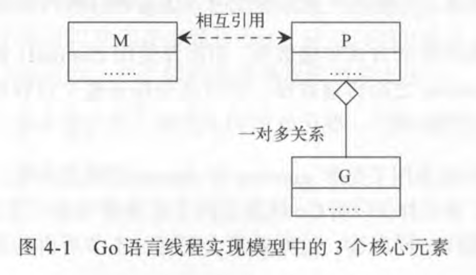
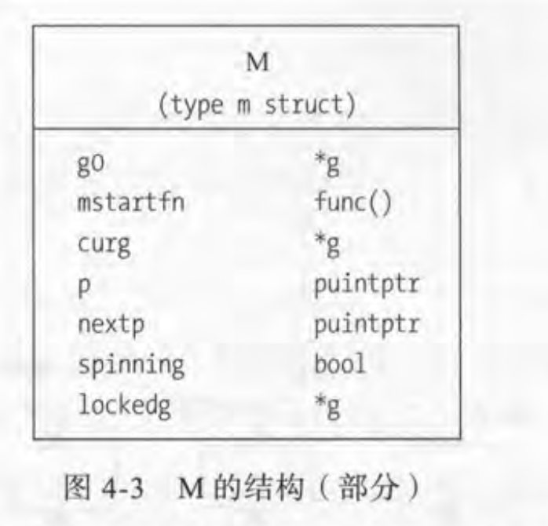
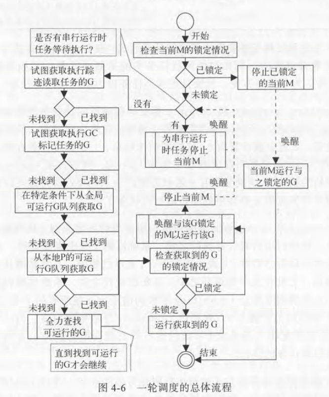

# 原理探究 #

----------------------

不要用共享内存的方式来通信，作为替代，应该以通信的手段来共享内存。`go` 不推荐使用共享内存来传递数据，而是使用`channel` (通道). `channel`主要是用来在 `gooroutine` 之间传递数据，并且还保证整个传递过程的安全性。

## `go` 语言构建的两级线程模型 ##

* 线程实现模型
    * `go` 线程模型的主要框架:

    > M (Machine): 一个 `M` 代表一个内核线程，或称“工作线程”;
    > P (Processor): 一个 `P` 代表代表执行一个 `go` 代码片段所必须的资源(或称"上下文环境");
    > G (Goroutine): 一个 `G` 代表一个 `go` 代码片段。
    

    * `M, P, G` 与 `KSE`(内核调度实体)的关系
    
    * `M` 与 `KSE` 之间总是一一对应，一个 `M` 仅且能够代表一个内核线程;
    * `Go`的 `runtime system`中用 `M` 代表内核调度实体;
    * `M`
        * 大多数情况下，创建一个 `M` 是由于没有足够的 `M` 来关联 `P` 并运行其中可运行的 `G`;
        * `M` 的结构
        * 左边是字段名，右边是字段类型;
        * `g0`是一个特殊的`goroutine`,它是运行时系统在启动之初创建的，用于执行一些运行时任务;
        * `mstartfn` 表示 `M` 的起始函数。其本质就是代码块`go` 语句携带的那个函数;
        * `curg` 用来存放当前 `M` 正在运行的那个 `G` 的指针;
        * `p` 指向与当前 `M` 相关联的那个 `P`;
        * `nextp` 用于暂存与当前`M`有关联的那个`P`;
            * `M` 和 `P`预联: 调度器将某个 `P` 赋给某个 `M` 的 `nextp`字段
        * `spinning` 用于表示这个 `M` 是否正在寻找可运行的 `G`.一点锁定，这个 `M` 就只能运行这个 `G`;
        * `lockdg` 表示的就是当前与 `M` 锁定的那个 `G`. 标准库 `runtime` 包中的函数 `LockOSThread` 和 `UnlockOSThread` 提供了锁定和解锁的具体方法。

      
    * P
        * 改变单个 `Go` 程序间间接拥有 `P` 的最大数量的两种方法:
            * 方法一: 调用函数 `runtime.GOMAXPROCS`, 并把想要的数量作为参数传入;
            * 方法二: 在 `Go` 程序运行前，设置 环境变量 `GOMAXPROCS`.
        * `P` 的最大数量实际上是对程序并发运行 `G` 的一直限制。`P` 的数量即为可运行队列 `G` 的数量。一个 `G` 在被启用后，会被追加到某个 `P` 的可运行 `G` 队列中，以等待运行时机。一个 `P` 只有与一个 `M` 关联在一起，才会使其可运行 `G` 队列中的 `G` 有机会运行。
        * 程序初始化时，会对 `P` 的最大数量进行设置，默认值为当前 `CPU` 的总核心数。
        * `GOPROCS`硬性上限值是`256`,操过这个值的设置，会被`256`所取代。
        * 运行时系统也会存在一个空闲 `P` 列表，当 `P` 中所有可运行的 `G` 全部被取出后，`P` 才可以被放入空闲`P`列表中。
        * 与 `M` 不通，`P` 本身是具有状态的:
          > `Pidle`: 表明当前`P`没有与任何`M`产生关联;
          > `Prunning`: 表明 `P` 当前正在与某个 `M` 关联;
          > `Psyscall`: 表明当前 `P` 中的那个运行的 `G` 正在进行系统调用;
          > `Pgcstop`: 表明运行时系统需要停止调度。比如，运行时系统在开始垃圾回收的某些步骤前，就会把全局 `P` 列表中的所有 `P` 都置于改状态。
          > `Pdead`: 表明当前 `P` 已经不会在使用。
          
    * G
        * 表示一个 `goroutine` 例程;
        * `Go` 编译器会把 `go` 语句编程对内部函数 `newproc` 的调用，并把 `go` 函数及其参数都作为参数传递给这个函数。
        * 运行时系统收到这样的调用后，先检查`go`函数及其参数的合法性，然后试着从本地的`P`的自由`G`列表和调度器的自由`G`列表中获取可用的`G`,如果两个地方都没能获取到，则会新建一个`G`。
        * 运行时系统也有一个`G`的全局列表，新创建的`G`会在第一时间被加入这个列表。
        * `G` 初始化完成后，会被放入本地`P`的 `runnext` 字段中，该字段用于存放新鲜出炉的`G`.如果 `runnext`这个字段已经有一个`G`了，那么已有的`G`会被转移到改 `P` 的可运行队列的末尾，如果该队列满了，那就只能追加到调度器可运行 `G` 队列的末尾。
        * 每一个 `G` 都会有运行时系统根据实际状况设置不同的状态:
          > `Gidle`: 表示当前 `G` 刚被新分配，还未被初始化;
          > `Grunnable`: 表示当前 `G` 正在可运行队列中等待运行;
          > `Grunning`: 表示当前 `G` 正在执行;
          > `Gsyscall`: 表示当前 `G` 正在 执行某个系统调用;
          > `Gwaiting`: 表示当前 `G` 正在阻塞;
          > `Gdead`: 表示当前 `G` 正处于空闲;
          > `Gcopystack`: 表示当前 `G` 的栈正在被移动，移动的原因可能是栈的扩展或伸缩。
        * `G` 的状态转换
          
    * 核心元素的容器
        * `M、P、G` 的容器表
          

* 调度器(也就是运行时系统)
    * 基本结构
        * 调度器的字段:
            * 空闲`M`列表，空闲`P`列表，可运行的`G`队列和自由`P`队列;
            * 另外一部分重要字段(串行运行时存在的)：
              
        * 一轮调度
          