# 密码

## 对称密码

 > 共享密码，用相同的密码进行加密和解密
 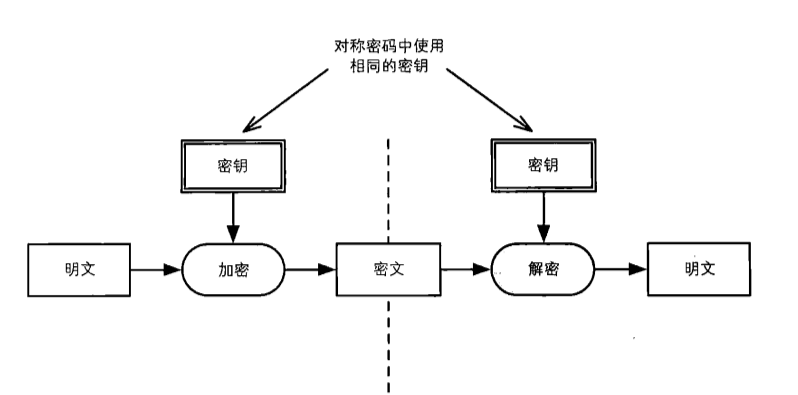

## 分组密码

## 公钥密码(非对称加密密码)

 > 用公钥进行加密，私钥进行解密
 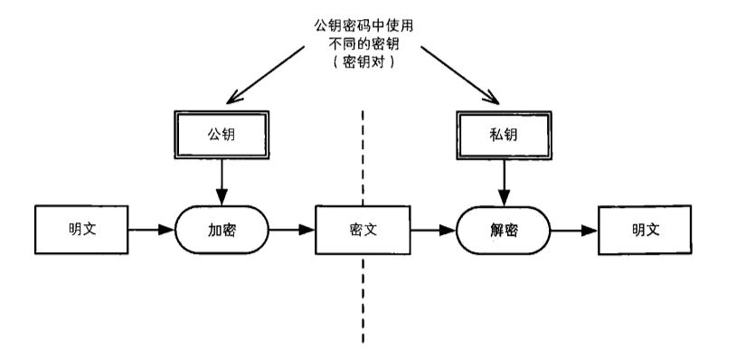

## 混合密码系统

 > 用对称密码提高速度，用公钥密码保护会话秘钥

# 认证

## 单项散列函数(获取消息的指纹)

## 消息认证码(消息是否被无差错传送)

- 在消息认证码中，发送者和接收者使用同一个共享密钥进行认证。认证码只能由持有合法密钥的人计算出来。将消息认证码附加在消息后面，就可以用来识别消息内容是否被篡改或者伪装。
- 消息认证码的密钥必须对除发送者和接收者外的任何人保密，否则就会产生篡改或伪装的风险。
- 消息认证码的密钥
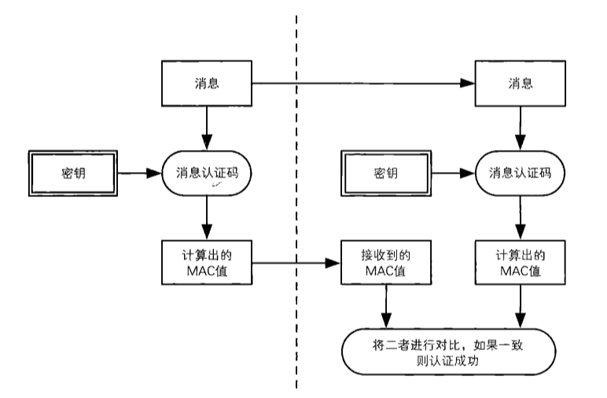

## 数字证书(消息的归属源)

 > 使用数字签名可以识别篡改和伪装，还可以防止否认。

### 数字签名

#### 从消息认证码到数字签名

- 消息认证码的局限:
    > 消息认证码无法防止否认
- 通过数字签名解决问题
    > 根据消息内容生成的一串数字，数字签名的内容是随着消息内容的改变而改变的。

#### 签名的生成和验证

> 在数字签名中，生成签名和验证签名需要使用各自私有的秘钥来完成。数字签名对签名秘钥和验证秘钥进行了区分，使用验证秘钥是无法生成签名的。签名秘钥只能由签名的人持有，而验证秘钥是任何需要验证签名的人都可以持有。

- 生成消息签名:

    根据消息内容计算数字签名的值。一般是由消息的发送者完成。

- 验证消息签名

    验证签名就是检查该消息是否真的属于期望的发送者。一般是由消息的发送者或者认可的第三方来完成。

- 公钥密码与数字签名使用方式

    --      | 私钥 | 公钥
    ------- | --- |----
    公钥签名 | 接受者解密时使用 | 发送者加密时使用
    数字签名 | 签名者生成签名时使用 | 验证者验证签名时使用
    谁持有秘钥 | 只能个人自己持有 | 只要需要，任何人都可以持有

#### 公钥密码与数字签名

- 公钥密码
  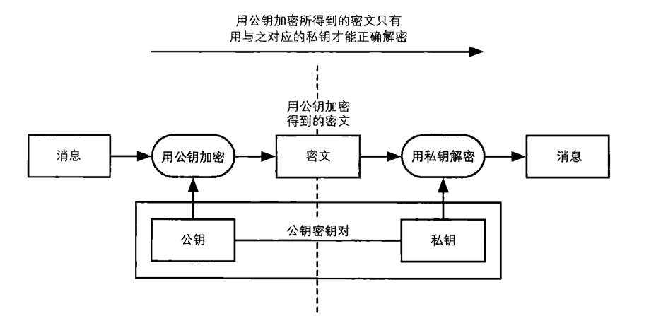

- 私钥进行加密(数字签名)
  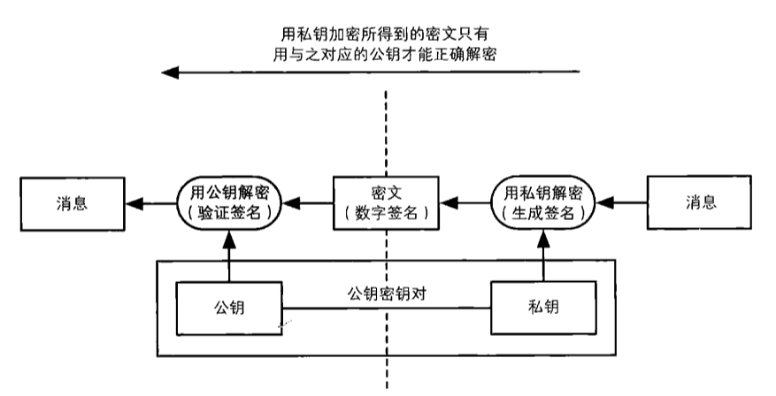

### 数字签名的方法

   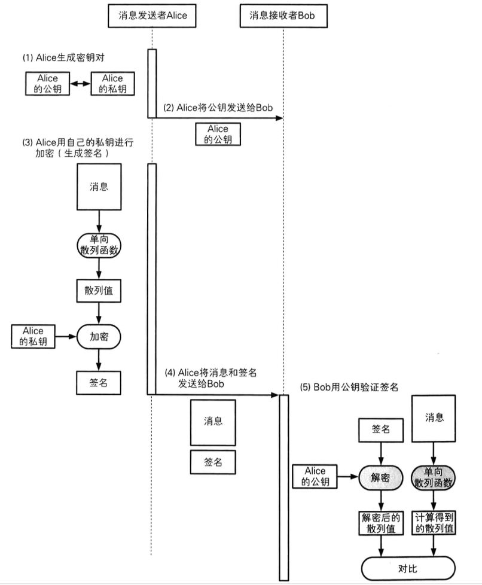

### 数字签名*QA*

> Q: 用私钥加密消息的签名，然后在用公钥解密消息并验证签名。这个过程中密文为什么能够具备签名的意义？
  A: 数字签名实在上是利用了`没有私钥的人事实上无法使用该秘钥生成密文`这一性质实现的。这里所生成的密文并非用于保证机密性，而是用来代表一种`只有持有改秘钥的人才能够生成的信息`。这样的信息一般可称作为`认证符号`. 消息认证码(MAC)也是认证符号的一种。数字签名是使用私钥进行加密来产生认证符号的。

> Q: 数字签名不能保证机密性吗?
  A: 是的。数字签名仅仅只是保存在计算机上的一种普通数据。可以附加在消息末尾，也可以和消息分离，单独作为文件来传送。数字签名真正的作用在于`特定的签名者与特定的消息绑定在一起`。无论这条签名被复制多少份，但是`是谁对这条签名进行了签名`这一点永远不会改变。

> Q: 消息内容会不会被任意篡改?
  A: 签名确实可以被修改，但是这样修改之后，验证签名时候就会出现错误，验证签名就会发现这一修改行为。数字签名所要起的作用并不是`防止修改`,而是用来`识别修改`.

> Q: 签名会不会重复的使用?
  A: 虽然可以将签名提取出来附加到其它的消息上，但是当验证签名时候会失败。在数字签名中，消息和签名之间具有对应关系，消息不同签名也会不同。因此，事实上无法将签名提取出来重复使用。

> Q: 如何防止否认?
  A: 在数字签名中，能够生成签名的秘钥(私钥)是只有发送方才能持有的，只有发送方才能进行签名，因此在一定程度上发送方很难否认这一点。

### 通过`RSA`实现数字签名

#### 用`RSA`生成签名

- 在`RSA`中，被签名的消息、密钥以及最后生成的签名都是以数字的形式存在；
- `RSA`生成签名的公式
  $$ 签名 = 消息^D \ mod \ N $$
  > `D` 和 `N` 就是签名者的私钥

#### 用 `RSA` 验证签名

- `RSA`验证签名的过程
  $$ 由签名求得的消息 = 签名^E \ mod \ N $$
  > `E` 和 `N` 就是签名者的公钥。
  > 将`有签名求得的消息` 与 发送者直接发生过来的`消息`内容进行对比，如何内容一致则签名验证成功，否则验证失败。

`RSA` 签名生成与验证表

密钥对  |  公钥     | 数 `E` 和 数 `N`
------ | ---------| -----------
  -   |  私钥     |   数 `D` 和 数 `N`
  生成签名  || $$ 签名 = 消息^D \ mod \ N $$ (消息的`D`吃饭除以`N`的余数)
  验证签名  || $$ 由签名求得的消息 = 签名^E \ mod \ N $$ (签名的`E`次日除以`N`的余数。)

### 对数字签名的攻击

- 对数字证书的中间人攻击
  具体来说就是主动攻击者介入发送者和接收者之间，对发送者而言伪装成接收者，对接收者而言就伪装成发送者，从而在无需破解数字签名前提下完成攻击。

- 防止中间人的数字签名攻击，就需要`确认自己所得的公钥是否真的属于自己期望的通信对象`

- 公钥加密->单项散列值(指纹)

### 各种密码技术的对比

#### 对称密码与公钥密码

---    |   对称密码    |  公钥密码
---    |   ----       | -----
发送者 |  用共享密钥加密 | 用公钥加密
接收者 | 用共享密钥解密  | 用私钥解密
密钥配送问题 | 存在  | 不存在，但公钥需要另外认证
机密性  | O   |  O

#### 消息认证码与数字签名

---  | 消息认证码  | 数字签名
-----  | --------  | ------
发送者  | 用共享密钥计算MAC | 用私钥生成签名
接收者  | 用共享密钥计算MAC | 用公钥验证签名
密钥配送 | 存在    | 不存在，但公钥需要另外认证
完整性  | O | O
认证 | O(仅限通信双方) | O(可使用任何第三方)
防止否认 | X | O

#### 混合密码系统对散列值加密

- 混合密码系统中，消息本身使用对称密码加密，只有对称密码的密钥使用公钥密码加密，即在这里对称密码的密钥相当于消息。
- 数字签名也使用了同样的方法。即消息本身输入单项散列函数就散列值，然后在对散列值进行签名，在这里散列值就相当于消息。
- 对称密码的`密钥是机密性的精华`。
- 单项散列函数的`散列值是完整性的精华`。

### 数字签名无法解决的问题

- 数字签名可以防止篡改、伪装以及防止否认，但是无法保证验证`签名的公钥属于真正的发送者`。
- 为了确认自己得到的公钥是合法的，我们需要使用`证书`.所谓证书就是将公钥当作一条消息，一个可信的第三方对其签名后所得到的公钥。

## 证书(给公钥加上数字签名)

### 什么是证书

- **公钥证书**
  类似于身份证或者驾照，里面包含有姓名、组织、邮箱等个人信息以及属于此人的公钥，并由认证机构施加数字签名。只要看到公钥证书，我们就可以知道认证机构已经认证该公钥就是属于此人。

- **证书的应用场景**
  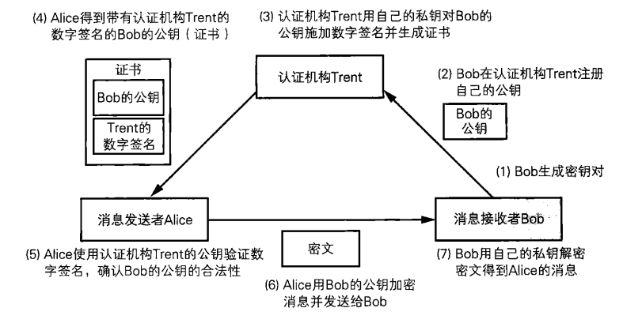

- **证书标准规范`X.509`**
  
  - `X.509`大致包含三部分

    - 签名前的算法 -- 签名对象的信息
    - 数字签名算法 -- 对证书签名时所使用的算法
    - 数字签名    -- 对证书施加的数字签名
  
  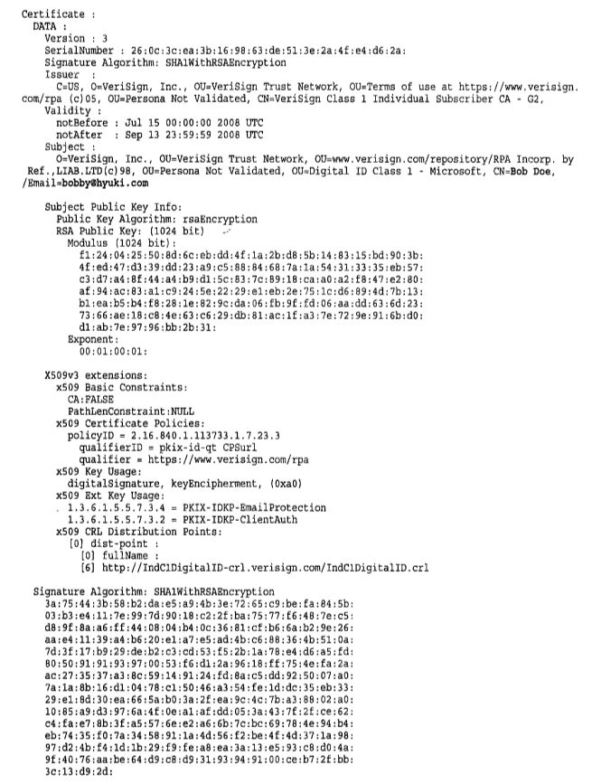

  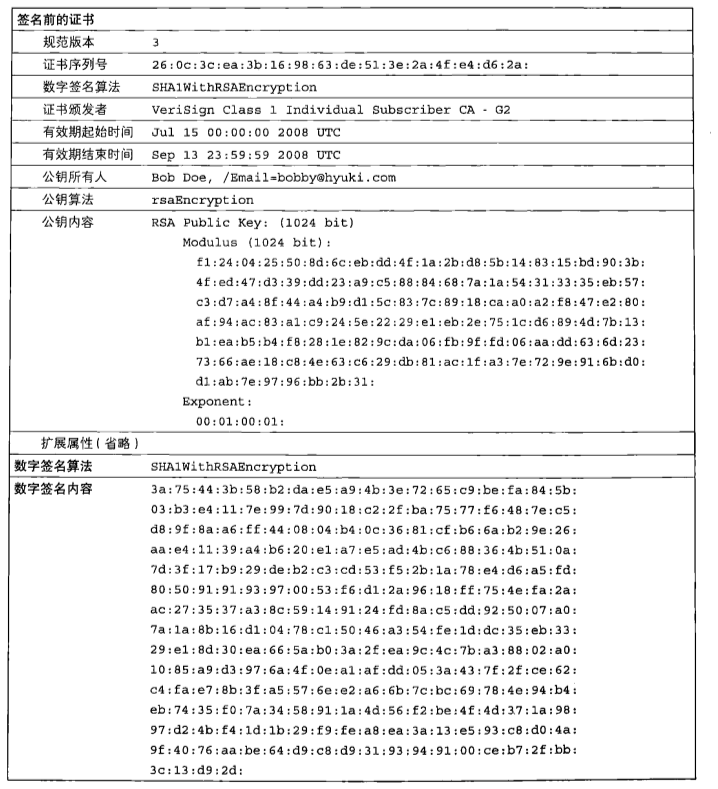

### 公钥基础设施`PKI`

- **什么是公钥基础设置**
  公钥基础设施是为了能够更有效的运用公钥而制定的一系列规范和规格的总称。诸如`RSA`公司制定的公钥密码标准`PKCS(Public-Key Cryptograph Standards)`等等。

- **`PKI`的基本组成**

  > `用户`: 使用`PKI`的人
  > `认证机构`: 颁发证书的实体
  > `仓库`: 保存证书的数据库

  - **用户**
    用户包括两种:一种是希望使用`PKI`注册自己公钥的人; 另一种就是希望使用已注册的公钥的人。
    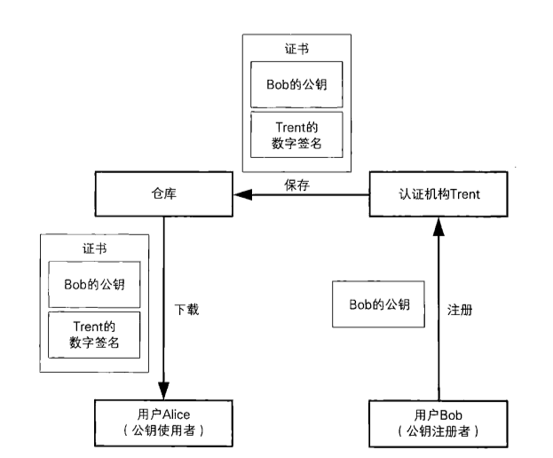

    - **[注册公钥的用户所进行的操作]**

      - 生成密钥对(也可由认证机构生成)
      - 在认证机构注册公钥
      - 向认证机构申请证书
      - 根据需要申请作废已注册的公钥
      - 解密接收到的密文
      - 对消息进行数字签名

    - **[使用已注册的公钥的用户所进行的操作]**

      - 将消息加密后发送给接收者
      - 验证数字签名

  - **认证机构(`CA`)**
    认证机构就是对证书进行进行管理的实体。认证机构具体的操作:

    - 生成密钥对(也可由用户自己生成)。在认证机构生成密钥对的情况下，认证机构需要将私钥发送给用户，这时需要使用`PKCS#12`等规范。
    - 在注册公钥时对注册者进行身份验证
    - 生成并颁发证书
      > 在用户自行生成密钥对的情况下，用户会请求认证机构来申请证书。申请证书所使用的规范是由`PKCS#10`所定义。在生成证书时，需要使用认证机构的私钥进行数字签名。生成的证书格式由`PKCS#6`和`X.509`来定义。
    - 作废证书

      - 用户的私钥丢失、被盗时，认证机构需要对其证书进行**作废**(`revoke`).
      - 要作废证书，认证机构需要制作一张**证书作废清单**(`CRL, Certificate Revocation List`).
  
    认证机构的工作中，公钥注册和其身份认证这一部分可以由注册机构`(RA, Registration Authority)`来分担。
  
  - **仓库**
    这是一个保存证书的数据库，`PKI`用户可以在需要的时候从其中获取证书。

- **证书的层级结构**

### 对证书的攻击

#### 在公钥注册之前进行攻击
  `证书`是认证机构对公钥及其持有者的信息加上数字签名的产物。

## 密码技术的总结

> 密钥是机密性的精华
> 散列值是完整性的精华
> 认证符号(`MAC`和数字签名)是认证的精华
> 种子是不可预测性的精华

- **对称密码**: 是一种用相同的密钥进行加密和解密的技术，用于确保消息的机密性。
- **公钥密码**: 是一种用不同的密码进行加密和解密的技术，和对称密码一样用来确保消息的机密性。和对称密码相比, 公钥密码系统速度很慢，因此，一般都会和对称密码组成混合密码系统一起来使用。公钥密码能够解决对称密码中密钥交换的问题，但存在中间人攻击被伪装的风险，因此需要对带有数字签名的公钥进行认证。
- **单项散列函数**: 是一种将长消息转换成短消息的技术，用于确保消息的完整性。
- **消息认证码(`MAC`)**: 是一种能够识别通信对象发送的消息是否被篡改的认证技术，用于验证消息的完整性、以及对消息进行认证。
- **数字签名**: 是一种能够对第三方消息进行认证，并能够防止通信对象做出否认的认证技术. `PKI`中使用的证书，就是对公钥加上认证机构的数字签名所构成的。
- **伪随机数生成器**: 是一种能够生成具备不可预测性的比特序列的技术，由密码和单项散列函数等构成。
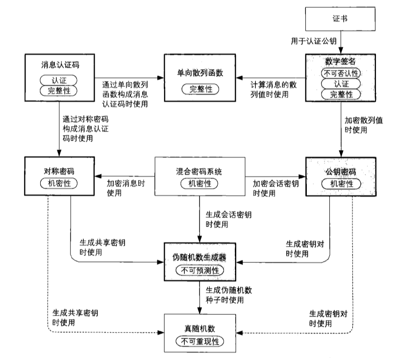
